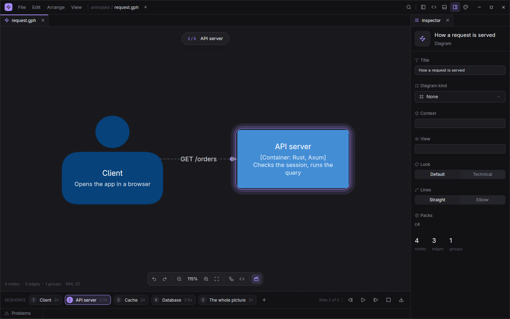
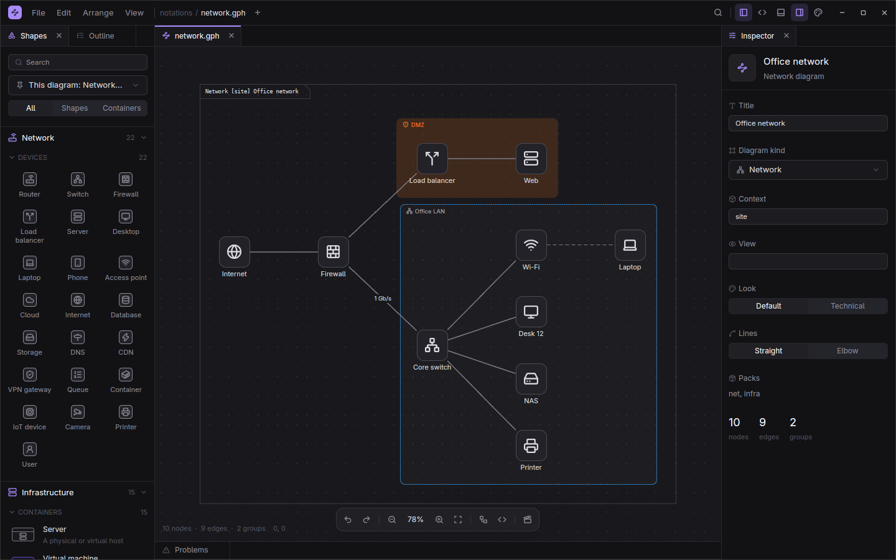
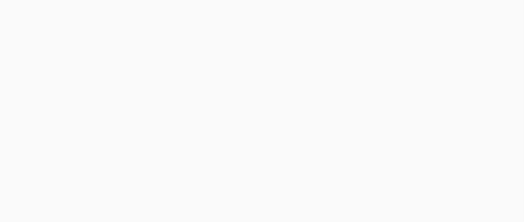
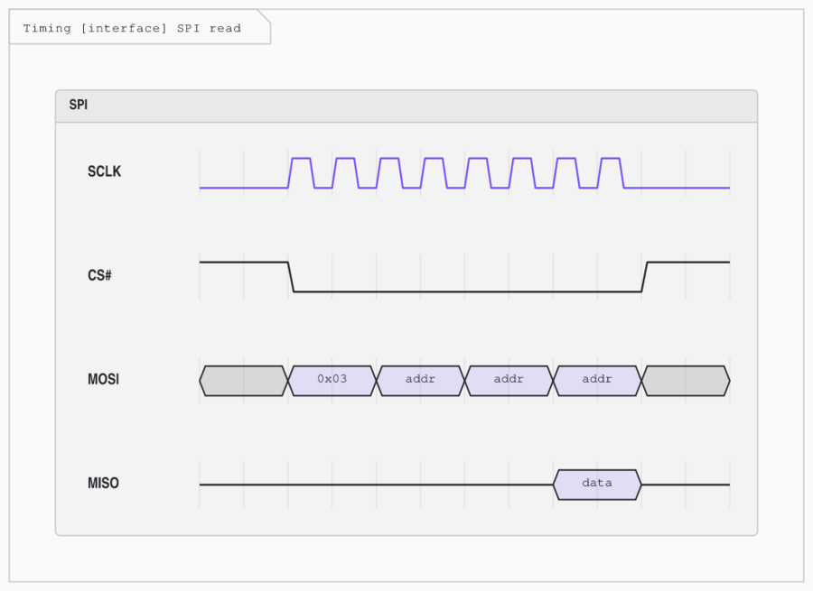
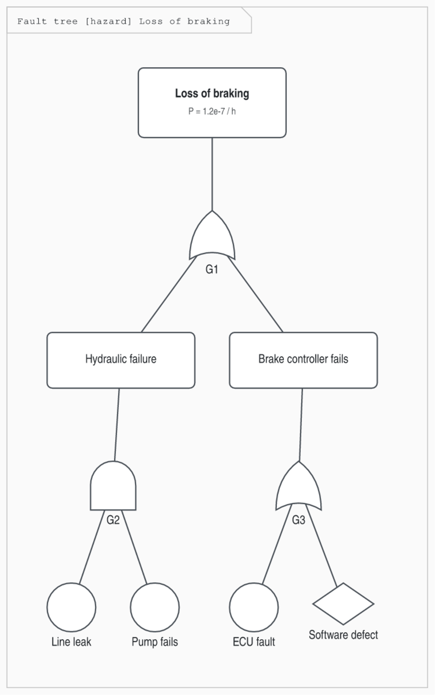
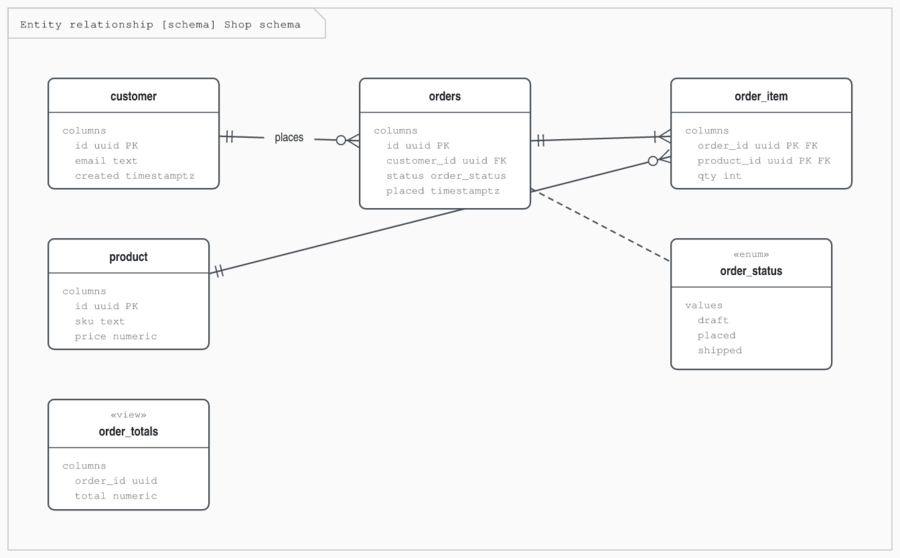
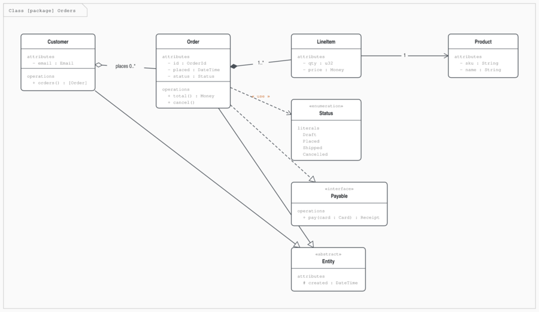

<h1 align="center">graphing</h1>

<p align="center">
  <b>Diagrams as plain text, edited on a real canvas.</b><br>
  Draw, sequence the story, present it step by step, and share it as a GIF, video or animated SVG.
</p>

<p align="center">
  
</p>

graphing is a desktop diagram editor written in Rust on gpui (through [gpui-kit](https://crates.io/crates/gpui-kit)). Every diagram is a small `.gph` text file: diff it, review it, keep it in git. The canvas edits that text in place, so your comments and formatting survive every drag and rename.

## Highlights

- **A canvas that feels like an editor.**
  - Dock panels where you like.
  - Command palette, keyboard shortcuts you can rebind, undo that covers everything.
  - A source pane with highlighting, completions and live problems.
- **Notations built in.** SysML, UML, C4, ER (crow's foot and Chen), BPMN, data flow and threat models, control block diagrams, fault trees, ArchiMate, event storming, timing diagrams, networks, org charts and mind maps.
- **Guided explainers.** Turn a diagram into steps that show, highlight, run dots along lines, move shapes and move the camera. Play it on the canvas, or export a GIF, WebM, animated PNG or animated SVG.
- **Layout that helps.**
  - Automatic layout: left to right, top down, or radial for mind maps.
  - Right-angled routing around shapes.
  - Snapping, alignment, a minimap.
- **One file to share.** `.gphz` packages carry the diagram, its pictures (animated GIF, WebP and AVIF included) and copies of the diagrams it links to.
- **Bring your diagrams.** Import Mermaid, draw.io, SysML v2 text and Visio `.vsdx`. Export SVG, PNG, SysML v2 and the animated formats.
- **Make it yours.**
  - Shape packs are plain JSON.
  - Plugins are sandboxed [Rune](https://rune-rs.github.io) scripts.
  - Settings live in a hand-editable `settings.json`.

<p align="center">
  
</p>

## The file is the diagram

```graphing
diagram "Checkout" { routing: orthogonal }
use c4

shopper: c4.person "Shopper" { description: "Buys things" }
web: c4.webapp "Storefront" { technology: "Rust, Axum" }
pay: c4.external-system "Payments" { description: "Card processing" }

shopper -> web "browses, pays" { kind: uses }
web -> pay "charges [HTTPS]" { kind: uses }

animate {
  step "Shopper" {
    show shopper
    highlight shopper
  }
  step "Storefront" 2.5s {
    show web
    flow shopper -> web
  }
  step "Payment" {
    show pay
    flow web -> pay
  }
}
```

Positions live in a `layout { }` block that the canvas maintains for you; leave it out and graphing lays the diagram out itself. See [docs/format.md](docs/format.md).

## Guided explainers

<p align="center">
  
</p>

Select shapes and press **+** in the sequence strip to make a step from them. Then:
- Drag a shape while a step is previewed to animate it moving.
- Press **Space** to play.
- Use File > Export > Animation to save a GIF, WebM, animated PNG or SVG.

The same file renders headless:

```sh
graphing render explainer.gph -o explainer.gif
graphing render explainer.gph -o explainer.webm
```

More in [docs/animation.md](docs/animation.md).

## Notations

Each notation is a shape pack with its own shapes, containers, line kinds and diagram kinds. Every one has an example in [examples/notations](examples/notations) and a template under File > New from Template.

| | |
| --- | --- |
|  |  |
|  |  |

Timing diagrams use WaveDrom's letters (`p.....`, `0.1..`, `x=.=.`). The full list of notations is in [docs/notations.md](docs/notations.md), and SysML specifics are in [docs/sysml.md](docs/sysml.md).

## Getting started

graphing builds from source with a recent stable Rust (1.88 or newer).

```sh
git clone https://github.com/Toyz/graphing
cd graphing
cargo run --release                     # open the editor
cargo run --release -- examples/auth.gph
```

graphing runs on Linux, macOS and Windows; CI builds and tests all three. Shortcuts use Cmd on macOS and Ctrl elsewhere.

- **Linux** needs the development packages for X11 or Wayland, xkbcommon, fontconfig and Vulkan (on Debian and Ubuntu: `libxkbcommon-x11-dev libwayland-dev libvulkan-dev libfontconfig-dev libx11-xcb-dev`).
- **macOS** needs the Xcode command line tools.
- **Windows** needs the MSVC build tools.

## Command line

The same binary renders, converts and packages diagrams without opening a window:

```sh
graphing check diagram.gph                       # parse and report problems
graphing render diagram.gph -o diagram.svg       # .svg .png .gif .webm .sysml
graphing render diagram.gph -o out.png --animate # animated PNG (or .svg)
graphing import flow.mmd -o flow.gph             # mermaid, draw.io, SysML v2, .vsdx
graphing pack diagram.gph -o diagram.gphz        # pictures and linked diagrams go inside
graphing unpack diagram.gphz -o folder/
graphing info diagram.gphz
```

## Extending

- **Shape packs** (`<config>/packs/<id>/pack.json`) add shapes, containers, line kinds and diagram kinds. A pack is JSON: SVG path outlines, inner details, icons, sections and fields. Nothing is hard-coded in Rust. The built-in notations use the same format.
- **Plugins** (`<config>/plugins/<id>/`) are Rune scripts. They run sandboxed, each on its own thread, and can only reach what their manifest asks for: reading or editing the open diagram, adding commands to the palette, registering shapes.

`<config>` is `~/.config/graphing` on Linux, `~/Library/Application Support/graphing` on macOS and `%APPDATA%\graphing` on Windows.

Both are described in [docs/plugins.md](docs/plugins.md), with working examples in [examples/packs](examples/packs) and [examples/plugins](examples/plugins).

## Project layout

| Crate | Does |
| --- | --- |
| `graphing-model` | The diagram model and the edit operations (with undo) |
| `graphing-dsl` | The `.gph` language: parser, printer, text-preserving edits |
| `graphing-scene` | Geometry: shape packs, layout, routing, animation timelines, waveforms |
| `graphing-export` | SVG, PNG, GIF, APNG, WebM and SysML v2 output |
| `graphing-import` | Mermaid, draw.io, SysML v2 and Visio input |
| `graphing-package` | The `.gphz` container |
| `graphing-script` | The Rune plugin host |
| `graphing-ui` | Design tokens and components on gpui |
| `graphing-app` | The editor |
| `graphing-bin` | The `graphing` executable and CLI |

Everything below `graphing-app` is free of UI code, so other programs can embed the format, renderer and exporters.

## Status

graphing is young and moving fast. The `.gph` format is settling but not frozen yet. Bug reports, notation requests and pull requests are all welcome: see [CONTRIBUTING.md](CONTRIBUTING.md) and the [code of conduct](CODE_OF_CONDUCT.md).

The app lists every crate it is built from, with its license, under Settings > Open Source.

## License

Licensed under either of

- Apache License, Version 2.0 ([LICENSE-APACHE](LICENSE-APACHE) or <https://www.apache.org/licenses/LICENSE-2.0>)
- MIT license ([LICENSE-MIT](LICENSE-MIT) or <https://opensource.org/licenses/MIT>)

at your option.

Unless you explicitly state otherwise, any contribution intentionally submitted for inclusion in the work by you, as defined in the Apache-2.0 license, shall be dual licensed as above, without any additional terms or conditions.
